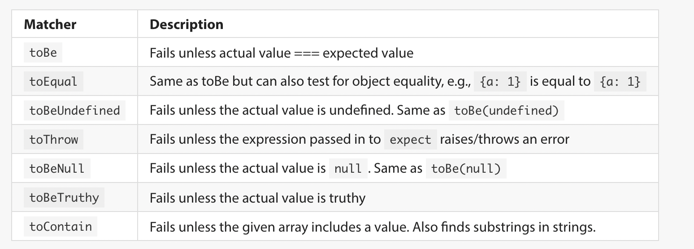

# JS130 Notes

## var

### REPL Behavior

In REPL, `var` creates variables on the global variable when defined outside function scope.

```JavaScript
var bar = 42;
console.log(global.bar); // 42
let foo = 86;
console.log(global.foo); // undefined
```

NOTE: This works in the REPL, but not in a ".js" file. This is due to a function wrapper in which Node executes code. In other words, the code is run in a function scope, not global scope.

## Function scope vs Block scope

Variable namespace is reserved at the top of the function or block in which it is declared. Whether function or block depends on the declaration keyword.

### Function scope

Variables declared with `var/function` are accessible from anywhere inside the function where it is declared, even if it was declared in a block which is never executed.

### Block scope

Variables declared with `let/const/class`.

## Scope

### Declared Scope

How an identfier is declared (`let/const/class` for block scope, `var/function` for function scope).

```JavaScript
let foo1 = 1;      // declared scope is block scope
var bar1 = 2;      // declared scope is function scope

if (true) {
  let foo2 = 3;    // declared scope is block scope
  var bar2 = 4;    // declared scope is function scope
}

function xyzzy() { // declared scope is function scope
  let foo3 = 5;    // declared scope is block scope
  var bar3 = 6;    // declared scope is function scope

  if (true) {
    let foo4 = 7;  // declared scope is block scope
    var bar4 = 8;  // declared scope is function scope
  }
}
```

### Visibility Scope

Where an identifier is available for use: global, local block, or local function scope. Based on the identifier's declared scope and position relative to blocks and functions.

```JavaScript
let foo1 = 1;      // visibility scope is global
var bar1 = 2;      // visibility scope is global

if (true) {
  let foo2 = 3;    // visibility scope is local block
  var bar2 = 4;    // visibility scope is global
}

function xyzzy() { // visibility scope is global
  let foo3 = 5;    // visibility scope is local function
  var bar3 = 6;    // visibility scope is local function

  if (true) {
    let foo4 = 7;  // visibility scope is local block
    var bar4 = 8;  // visibility scope is local function
  }
}
```

### Lexical Scope

Variable accessibility or whether a variable is in the inner or outer scope relative to another location at any point in the program.
NOTE: `var/function` is always considered outer scope of a block statement.

```JavaScript
// Block-Scoped Examples

let foo1 = 1;      // outer scope of xyzzy, outer scope of if block on line 3

if (true) {
  let foo2 = 3;    // inner scope of if block on line 3
}

function xyzzy() {
  let foo3 = 5;    // inner scope of xyzzy, outer scope of if block on line 10

  if (true) {
    let foo4 = 7;  // inner scope of if block on line 10
  }
}

// Function-Scoped Examples

var bar1 = 1;      // outer scope of xyzzy, outer scope of if block on line 3

if (true) {
  var bar2 = 3;    // outer scope of xyzzy, outer scope of if block on line 3
}

function xyzzy() {
  var bar3 = 5;    // inner scope of xyzzy, outer scope of if block on line 10

  if (true) {
    var bar4 = 7;  // inner scope of xyzzy, outer scope of if block on line 10
  }
}
```

## Hoisting

A mental framework which explains how declarations are handled during the **creation phase** of a program. Hoisting is the process of making each variable available at the top of their respective scope (function or block).

### Differences by keyword

`var` : Initialized to `undefined`
`let/const/class` : Namespace is reserved without an initial value (throws `ReferenceError`).
`function` : Hoist entire body and declaration. Can be invoked successfully prior to declaration

NOTE: Declaring an identifier with both `var` and `function` may exhibit strange depending on the order in which the values are declared and accessed/invoked when they share the same name. `function` gets hoisted and `var` can reassign the function variable.

## Strict mode

Changes:

<li>
Implicit Execution is `undefined`, not `global`
Does not allow Octal literals
Prevents declaring two function parameters with the same name
Prevents using `let` and `static` as variable names
</li>

## Closures

The packaging of pointers to lexically in-scope variables along with a function when assigning a function as a variable. In order to make use of closures, you create a function which does the following:

<li>
Defines private data at the top of the function scope.
Returns another function or object which interacts with the private data within the closure.
</li>

```JavaScript
function closure() {
  let counter = 0; // => Declared in function scope along with the function below
  return function() {
    return counter += 1; // => access variable in outer scope
  };
}

let incrementer = closure(); // invocation returns a funciton with private variable counter
let anotherIncrementer = closure(); // invocation returns a function with its own, independent variable counter

console.log(incrementer()); // => 1
console.log(incrementer()); // => 2
console.log(incrementer()); // => 3
console.log(anotherIncrementer()); // => 1
console.log(anotherIncrementer()); // => 2
console.log(anotherIncrementer()); // => 3
```

When the returned function or object is assigned to a variable in another scope, the closure will ensure that the private data that was in the function scope which returned the object/function remains in scope whenever accessing that object or invoking the function or method which references it.

## Private Data

Closures allow a function to access variables which pull from the outer scope of the function declaration. This means at the point of invocation, the variable being accessed may be out of scope. This allows us to essentially package functions with private variables.

## Partial function application

When defining a closure, the outer function accepts one or more, but not all, of the parameters needed by the function returned in the closure.

```JavaScript
function makeAdder(firstNumber) {
  return function(secondNumber) {
    return firstNumber + secondNumber;
  };
}

let addFive = makeAdder(5); // => five is stored as firstNumber in the closure
let addTen = makeAdder(10); // => ten is stored as firstNumber in the closure

console.log(addFive(3));  // 8
console.log(addFive(55)); // 60
console.log(addTen(3));   // 13
console.log(addTen(55));  // 65
```

## IIFEs (Immediately Invoked Function Expressions)

IIFEs are function expressions which are defined and immediately invoked.

```JavaScript
(function() {
  console.log("hello");
})(); // => hello

((first,second) => first * second)(5, 6); // => returns 30
```

The function scope creates a private lexical namespace which can help you avoid unintentionally altering a previously declared variable. This applies to variables within the function, as well as the function name itself. Blocks can accomplish a similar effect.

```JavaScript
let arr = [1, 2, 3];

{
  let arr = [1, 2, 3];
  arr.pop();
  console.log(arr); // => [1, 2]
}

console.log(arr); // => [1, 2, 3]
```

Saving IIFEs to variables can be very convenient:

```JavaScript
const makeUniqueId = (function() {
  let count = 0;
  return function() {
    count += 1;
    return count;
  }
})();

makeUniqueId(); // 1
makeUniqueId(); // 2
makeUniqueId(); // 3
```

In this example, an IIFE creates a closure with a counter and stores a function which increments and returns a counter into a variable. This means the Id can be generated directly by calling makeUniqueId;

## Shorthand Notation

### Destructuring 1: Objects

```JavaScript
let obj = {
  prop1 : 1,
  prop2 : 2,
  prop3 : 3,
};

let prop1 = obj.prop1;
let prop2 = obj.prop2;
let prop3 = obj.prop3;

// can be shortened!

let { prop1, prop2, prop3 } = obj;
```

### Destructuring 2: Function Parameters

```JavaScript
function xyzzy({ prop1, prop2, prop3}) {
  console.log(prop1); // 1
  console.log(prop2); // 2
  console.log(prop3); // 3
}

let obj = {
  prop1: 1,
  prop2: 2,
  prop3: 3,
}
```

NOTE: Parameter names must match property key names.

### Destructuring 3: Arrays

```JavaScript
let foo = [1, 2, 3];
let [ first, second, third ] = foo;
```

## Spread Syntax

Use of `...arr` to separate array or object properties into separate items.

### Application 1: Pass Array Elements as Arguments

```JavaScript
let arr = [1, 2, 3];
function logNums(n1, n2, n3) {
  console.log(n1);
  console.log(n2);
  console.log(n3);
}

logNums(...arr); // logs 1 2 3
```

### Application 2: Clone & Concatenate Arrays and Objects

Array:

```JavaScript
let arr = [1, 2, 3];
let arrClone = [...arr]; // => [1, 2, 3]
console.log(arr === arrClone); // => false

let combinedArr = [...arr, ...arrClone]; // => [1, 2, 3, 1, 2, 3]
```

Object:

```JavaScript
let obj = {
  prop1: 1,
  prop2: 2,
};

let otherObj = {
  prop3: 3,
  prop4: 4,
};

let objClone = {...obj}; // => { prop1: 1, prop2: 2 }
console.log(obj = objClone); // => false

let combinedObj = {...obj, ...otherObj}; // => { prop1: 1, prop2: 2, prop3: 3, prop4: 4 }
```

### Rest Operator

Takes remaining elements of an array or object and stores them in a new array/object. Good for arrays or objects of undetermined length.

```JavaScript
function maxItem(first, ...moreArgs) {
  let maximum = first;
  moreArgs.forEach(value => {
    if (value > maximum) {
      maximum = value;
    }
  });

  return maximum;
}

console.log(maxItem(2, 6, 10, 4, -3)); // logs 10
```

## Modules (CommonJS)

1. CommonJS/Node Modules

<li>
Synchronous: Not compatible with browser
Originally included in Node
<li>

2. JS (ES/ECMAScript) Modules

<li> Used in Browser </li>

### CommonJS Modules

In order to share variables across files, you must export using `module.exports` for each export, then use `require('./path')` to import.

```JavaScript
// in logit.js

function logIt(string) {
  console.log(string);
}

module.exports = logIt;
```

```JavaScript
// in main.js
let logIt = require("./logit");
logIt("Works!"); // logs Works!
```

### Path References

1. NPM Module: use package name in quotes as path
2. Local File System: use './' in path to indicate relative path

### Destructuring with modules

```JavaScript
// in logit.js

let prefix = ">> ";

function logIt(string) {
  console.log(`${prefix}${string}`);
}

function setPrefix(newPrefix) {
  prefix = newPrefix;
}

module.exports = {
  logIt,
  setPrefix,
};
```

```JavaScript
// in main.js

const { logIt, setPrefix } = require("./logIt");
logIt("You rock!"); // logs >> You rock!
setPrefix("++ ");
logIt("You rock!"); // logs ++ You rock!
```

## Exceptions

Throw an Error/Raise an Exception
Exception Handler: `try/catch` statements, where the `try` block runs the code and the `catch` block does something in case of an error. `Error` is a type from which `ReferenceError`, `TypeError`, and `SyntaxError` inherit.

### Throwing an Error

There are a few ways the `throw` keyword can assist in stopping the program.

### `throw`

By itself, `throw` merely stops the program immediately and prints the location of the `throw` statement.

```JavaScript
let arr = [1, 2, 3];
arr.forEach(elem => {
  if (elem === 2) {
    throw "Illegal Number: 2";
  }

  console.log(elem);
});

// Output
// 1

// /home/ec2-user/environment/js139/practice/throw.js:5
//     throw "Illegal Number: 2";
//     ^
// Illegal Number: 2
// (Use `node --trace-uncaught ...` to show where the exception was thrown)
```

### `throw new Error("ErrorType")`

Full Stack Trace is pulled in and description is given for the error.

```JavaScript
let arr = [1, 2, 3];

arr.forEach(elem => {
  if (elem === 2) {
    throw new Error("Illegal Number: 2");
  }

  console.log(elem);
});

// Output
// 1
// /home/ec2-user/environment/js139/practice/throw.js:5
//     throw new Error("Illegal Number: 2");
//     ^

// Error: Illegal Number: 2
//     at /home/ec2-user/environment/js139/practice/throw.js:5:11
//     at Array.forEach (<anonymous>)
//     at Object.<anonymous> (/home/ec2-user/environment/js139/practice/throw.js:3:5)
//     at Module._compile (node:internal/modules/cjs/loader:1092:14)
//     at Object.Module._extensions..js (node:internal/modules/cjs/loader:1121:10)
//     at Module.load (node:internal/modules/cjs/loader:972:32)
//     at Function.Module._load (node:internal/modules/cjs/loader:813:14)
//     at Function.executeUserEntryPoint [as runMain] (node:internal/modules/run_main:76:12)
//     at node:internal/main/run_main_module:17:47
```

### Custom Error Types

```JavaScript
class MyCustomError extends Error {}

if (true) {
  throw new MyCustomError("Specific Situation");
}
```

### `try/catch` statements

A `try` block contains code which may throw an error, and the `catch` block allows alternative code to run in the case of an error.

## Pure functions and side effects

### Side effects

A function is said to have a side effect if it does any of the following:

1. Reassigns any non-local variable or object which references a non-local variable.

<li> 
Reassignment of a varible in outer scope.
Mutation of an object/array/class which is in outer scope or passed in as an argument.
</li>

2. Reads from or writes to any data entity that is non-local to its program.

<li>
Reading from or writing to another file, database, or webpage.
Reading keyboard input.
Writing to the console/ Updating display.
Accessing hardware features (input devices, clock/calendar, camera, audio, `Math.random()`)
</li>

3. Raises an exception, if it both...
<li>
Does not catch and handle the exception or...
Has side effects in the catch block
</li>

4. Calls another function that has any side effects that are not confined to the current function.

### Pure function

A function that:

1. Has no side effects.
2. Will always return the same value given the same set of arguments.

## Testing with Jest

### Why Write Tests?

The main reason to write tests for your programs is to prevent **regression**, or to make sure that previously working code does not stop working after a change to your code or environment.

### Testing Terminology

**Test Suite**
The entire set of tests for a project/program/application.

**Test (Specs)**
Testing for a specific situation. Consists of one or more assertions.

**Assertion (Expectation)**
Verification step that confirms the program did what it should.

### Writing tests

1. Export the code you want to test using `module.exports`
2. Require the file to be tested in your `jest` test file
   The test file for `file.js` should be named `file.test.js`
3. Create tests to run for `file.test.js`

```JavaScript
const Car = require("./file");

describe("The Car class", () => { // Grouping of tests
  test("has four wheels", () => { // Test
    let car = new Car();
    expect(car.wheels).toBe(4);   // Assertion (expect) & Matcher (toBe)
  });
});
```

Skipping Tests: replace `test` with `xtest`

### expect and matchers



## SEAT Approach

<li>
Set up the necessary objects.
Execute the code against the object we're testing.
Assert the results of execution.
Tear down and clean up any lingering artifacts.
</li>

## Packaging

### Project

A collection of files used to develop, test, build, and distribute software. Software includes executable program, library module, or a combination of both. The project includes the source code, tests, assets, databases, config files, and more.

### Setting up a Project

1. Initialize repository (locally or remotely)
2. npm init (create package.json)
3. .gitignore (`echo node_modules >> .gitignore`)
4. Folders
   a. test => contains all tests
   b. lib => code files
   c. node_modules => created when downloading dependencies

### npm and npx

npm : Used to install a package intended to be `require`'d by your project
npx : Executable CLI tool used with project (i.e. Eslint)

## package.json and package-lock.json

### `package.json`

A configuration file used to manage dependencies along with other ease-of-use features.

`npm init` => Establishes a package.json which:

<li>
Stores dependencies and versioning preferences for a project
Allows projects to be transmitted more efficiently
Allows someone to install dependencies automatically with `npm install`
Stores scripts which can automate certain CLI commands
</li>

### `package-lock.json`

File which shows the precise versions of packages which were installed upon `npm install` or `npm i -S pkg`

### Installing

1. Install/uninstall globally: `npm i -g pkg` | `npm r -g pkg`
<li>
Installs in path for access by all directories
Recommended for CLI Executables (i.e. heroku) and other non-project related CLI tools.
Not recommended for project files since the environment cannot be easily cloned (ie versioning, dependencies)
</li>

2. Install/uninstall: `npm i pkg` | `npm r pkg`
<li>
Fine for trying out packages
Does not save any dependency or versioning data
</li>

3. Install/Uninstall as Dependency: `npm i -S pkg` | `npm r -S pkg`
<li> Must have package.json </li>

4. Install/Uninstall as Dependency: `npm i -D pkg` | `npm r -D pkg`
<li> `npm prune` removes dependencies which were removed from package.json and no longer needed in node_modules </li>

### Requiring specific parts of a library

```JavaScript
// This imports the entire lodash package
// Con: System memory needs to remember entire package
// Con: Processing lags due to loading entire package
const _ = require("lodash");

// This option only pulls from the 'chunk' file
// Pro: Processing Effiency
// Pro: Memory Efficiency
// Con: Only works for independent files (no `require` within referenced file)
const chunk = require("lodash/chunk");

// This option loads the package, but only saves 'chunk`.
// Pro: Memory Efficiency
// Pro: Works with interdependent package files
// Con: Processing lags due to loading entire package before extracting 'chunk'
const chunk = require("lodash").chunk;
```

## Transpilation

The process of converting source code into another version or language.

### Babel

Most widely used tool for ES6 => ES5 transpilation.

To use Babel:

1. Configure Babel to run automatically.
2. Install in Command Line (locally)
<li>
Install: `npm i -D @babel/core @babel/cli`
Transpile: `npx babel lib --out-dir dist`

This command transpiles all files in lib and puts them in a directory, `dist`.

</li>
<li>
Install Presets/configure Babel
Example: ES5 Preset `env`
<ol>
Install preset => `npm install --save-dev @babel/preset-env`

Run command with preset => `npx babel lib --out-dir dist --presets=@babel/preset-env`

</ol>
</li>

### npm scripts

In `package.json`, key/value pairs contained in `"scripts": {}` become aliases (keys) for commands (values). To use an alias, use `npm run` followed by the script name.

## Asynchronous Programming

Asynchronous functions do not block execution for the rest of the program. Asynchronous code does not run when the runtime encounters it, but rather run concurrently with other operations so that the caller doesn't have to wait for the task to finish running.

### `setTimeout`

Accepts a callback function and the time to delay execution in milliseconds. JavaScript will not run `setTimeout` until the entire program is finished, even if the delay is 0.

### `setInterval`

Accepts a callback function and a period of time, in milliseconds, to delay between invocations.

```JavaScript
function save() {
  // Send the form values to the server for safekeeping
}

// Call save() every 10 seconds
var id = setInterval(save, 1000);

// Later, perhaps after the user submits the form
clearInterval(id);
```

### Promises

A promise is a class which has three potential states: pending, fulfilled, or rejected.

```JavaScript
let p = new Promise((resolve, reject) => { // promise takes a callback as an argument
  let a = 1 + 1;
  if (a === 2) { // condition for success
    resolve("Success!");
  } else {
    reject("Failed.");
  }
});

p.then((message) => { // then is activated upon fulfillment and may be chained
  console.log(`This is in the then ${message}`);
}).catch((message) => { // catch activated upon rejection. Handles errors or restarts process
  console.log(`This is in the catch${message}`);
});
```
